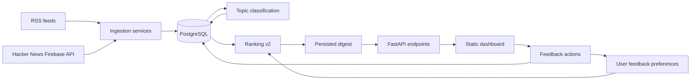

# YourNews

YourNews is a feedback-based personalized news recommendation backend. It ingests articles from RSS feeds and Hacker News, normalizes and deduplicates them, classifies topics, ranks stories for each user, and can persist generated digests for later review.

The project is intentionally backend-focused: it demonstrates a production-style data pipeline, API design, persistence, recommendation logic, and automated tests without adding unrelated product scope such as authentication, AI summaries, or deployment infrastructure.

## Problem solved

Most news readers either show the same feed to everyone or require a complex machine-learning stack before personalization is useful. YourNews keeps the MVP practical:

- Collect articles from multiple source types.
- Normalize them into one database model.
- Classify each article into simple topics.
- Let user feedback adjust topic preferences.
- Generate transparent, explainable digest rankings.
- Persist generated digests so a daily pipeline can produce reviewable output.

## Architecture overview



At a high level:

1. **Ingestion** fetches RSS and Hacker News stories, normalizes them into a common article shape, and inserts only new URLs.
2. **Classification** assigns topic labels to unclassified articles using deterministic keyword rules.
3. **Ranking v2** scores digest candidates with topic, user preference, freshness, and source diversity components.
4. **Digest generation** persists ranked articles as `Digest` and `DigestItem` rows.
5. **Feedback** updates user topic preferences, closing the personalization loop.

More detail is available in [`docs/ARCHITECTURE.md`](docs/ARCHITECTURE.md).

## Main features

- FastAPI backend with health, article, source, user, feedback, digest preview, and persisted digest endpoints.
- PostgreSQL data model managed with SQLAlchemy and Alembic.
- RSS ingestion using seeded RSS sources across general news, world, technology, business/finance, science, and sports.
- Hacker News ingestion from the public Firebase API (`top`, `new`, and `best` stories).
- URL normalization and database-level deduplication.
- Expanded topic classification covering sports, politics/world, technology, cybersecurity, business/finance, science, health, culture, entertainment, gaming, climate, and more.
- Feedback loop with `INTERESTING`, `NEUTRAL`, and `NOT_INTERESTING` labels.
- Ranking v2 with explainable score breakdowns:
  - topic score
  - user preference score
  - freshness score
  - source diversity penalty
- Persisted digest workflow using existing `Digest` and `DigestItem` models.
- Email-first local/dev delivery records for persisted digests, with tracked feedback links in HTML-email and plain-text bodies.
- Daily pipeline runner for ingestion → classification → digest generation.
- Minimal static dashboard served by FastAPI at `/`.
- Deterministic pytest coverage for ingestion, classification, ranking, feedback, digests, APIs, and CLI runners.

## Tech stack

- **Python**
- **FastAPI**
- **PostgreSQL**
- **SQLAlchemy**
- **Alembic**
- **Pydantic Settings**
- **Docker Compose**
- **pytest**
- **feedparser** for RSS parsing
- **httpx** for Hacker News API calls
- **Static HTML/CSS/JavaScript** for the dashboard

## Quick start with Docker

From a fresh clone:

```bash
cp .env.example .env
docker compose up --build
```

In another terminal, apply migrations:

```bash
docker compose exec app alembic upgrade head
```

Open:

```text
http://127.0.0.1:8000/
```

Check service health:

```bash
curl http://127.0.0.1:8000/health
```

## Demo workflow

This sequence starts from a fresh clone and creates a working local demo with seeded sources, ingested articles, classified topics, sample feedback, and personalized digest output.

```bash
cp .env.example .env
docker compose up --build
docker compose exec app alembic upgrade head
docker compose exec app python -m app.demo.run_demo
```

The demo script creates or reuses `demo@yournews.local`, seeds default RSS sources, ingests enabled RSS feeds, classifies unclassified articles, submits sample feedback when possible, and prints the demo user's preferences and top digest items.

Useful local URLs after the demo:

- Dashboard: `http://127.0.0.1:8000/`
- OpenAPI docs: `http://127.0.0.1:8000/docs`
- Articles: `http://127.0.0.1:8000/articles?limit=10`
- Sources: `http://127.0.0.1:8000/sources`
- Digest preview: `http://127.0.0.1:8000/digest/preview?user_id={user_id}`

## Daily pipeline command

Run the full MVP pipeline with one command after migrations:

```bash
docker compose exec app python -m app.pipeline.run_daily_digest --limit-per-user 10 --hn-limit 30
```

The daily pipeline:

1. Ingests enabled RSS sources.
2. Ingests Hacker News top stories.
3. Classifies unclassified articles.
4. Generates persisted digests for existing users.
5. Skips users when no digest can be generated.
6. Prints counts for processed sources, inserted articles, classified articles, processed users, created digests, and skipped users.

## API examples

Create or reuse a user:

```bash
curl -X POST http://127.0.0.1:8000/users \
  -H "Content-Type: application/json" \
  -d '{"email":"demo@yournews.local"}'
```

List recent articles:

```bash
curl "http://127.0.0.1:8000/articles?limit=10"
```

Preview a personalized digest without persisting it:

```bash
curl "http://127.0.0.1:8000/digest/preview?user_id={user_id}&limit=10"
```

Generate and persist a digest:

```bash
curl -X POST "http://127.0.0.1:8000/digests/generate?user_id={user_id}&limit=10"
```

Read a persisted digest:

```bash
curl "http://127.0.0.1:8000/digests/{digest_id}"
```

Preview email-style delivery output without sending email:

```bash
curl "http://127.0.0.1:8000/digests/{digest_id}/delivery-preview"
```

Create a local/dev email delivery record. This does not send external email; it stores the rendered HTML/text bodies and feedback links for inspection:

```bash
curl -X POST "http://127.0.0.1:8000/digests/{digest_id}/send"
```

List delivery history for a digest or inspect one stored delivery:

```bash
curl "http://127.0.0.1:8000/digests/{digest_id}/deliveries"
curl "http://127.0.0.1:8000/deliveries/{delivery_id}"
```

List a user's saved digests:

```bash
curl "http://127.0.0.1:8000/users/{user_id}/digests"
```

Submit feedback:

```bash
curl -X POST http://127.0.0.1:8000/feedback \
  -H "Content-Type: application/json" \
  -d '{"user_id":1,"article_id":1,"label":"INTERESTING"}'
```

More endpoint examples are available in [`docs/API_EXAMPLES.md`](docs/API_EXAMPLES.md).

## Dashboard usage

The dashboard is a polished, build-free static interface served by FastAPI. It is designed for portfolio-friendly local demos while staying intentionally simple: no React, no frontend build tool, and no external JavaScript dependencies.

Basic flow:

1. Open `http://127.0.0.1:8000/`.
2. Create or reuse a user by email.
3. Load a digest preview and inspect rich digest cards with topics plus Ranking v2 score breakdowns.
4. Submit feedback with the segmented controls; saved selections are restored when the digest reloads.
5. Reload preferences to see graphical topic weights change.
6. Generate a saved digest, list saved digests, inspect saved digest details, and send a local/dev email delivery simulation.
7. Inspect delivery history and the stored HTML/text email bodies with tracked feedback links.
8. Load recent articles to inspect ingested content.

## Product coverage updates

Recent MVP additions make the product demo broader while keeping external provider integrations out of scope:

- **Email-first delivery architecture:** persisted digests can be rendered as HTML email-style content and plain text via `GET /digests/{digest_id}/delivery-preview`, then stored as local/dev email delivery records via `POST /digests/{digest_id}/send`. No real external email is sent.
- **Tracked email feedback:** each delivered article includes normal links for Interesting, Neutral, and Not interesting actions. The links call `GET /feedback/click` and update preferences for future digests.
- **Broader sources:** default RSS seeding now covers general news, world/news, technology, business/finance, science, and sports sources.
- **Expanded topics:** classification includes sports (`football`, `basketball`, `tennis`), politics/world/Israel, technology/AI/cybersecurity, business/finance/startups, science/health/climate, and culture/entertainment/gaming.

## Local development without Docker

```bash
python -m venv .venv
source .venv/bin/activate
pip install -r requirements.txt
pytest
```

For the API outside Docker, set `DATABASE_URL` to a reachable PostgreSQL database and run migrations before starting Uvicorn.

## Testing

Run the full test suite:

```bash
pytest
```

Run a syntax/bytecode check for the application package:

```bash
python -m compileall app
```

## What this project demonstrates

For recruiters and reviewers, YourNews demonstrates practical backend engineering work across:

- **Data ingestion:** RSS and Hacker News source ingestion with deterministic test coverage.
- **Normalization and deduplication:** shared normalized article shape and URL-based insertion flow.
- **Recommendation logic:** transparent ranking with topic, preference, freshness, and source diversity components.
- **Feedback loop:** user feedback updates topic preferences that affect future digest ranking.
- **Backend APIs:** FastAPI endpoints for users, articles, sources, feedback, digest preview, and persisted digests.
- **Database modeling:** SQLAlchemy models and Alembic migrations for a relational PostgreSQL schema.
- **Dockerized local environment:** app and database orchestration through Docker Compose.
- **Automated tests:** unit and API tests for core services, CLI runners, and endpoint behavior.

## Future improvements

Realistic next steps:

- Add scheduled jobs for the daily pipeline.
- Add a real email provider such as SMTP or SendGrid behind the existing local delivery interface.
- Consider Telegram as a future delivery provider; it is not implemented in the MVP.
- Improve topic classification with richer rules or a dedicated classifier.
- Build a more complete frontend while keeping the API-first design.

## Current non-goals

The project intentionally does not include authentication, AI-generated summaries, deployment automation, React, Telegram integration, or real email sending. Those would be reasonable future additions, but the current focus is the backend data and recommendation pipeline.
