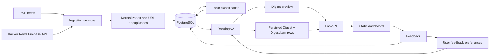

# YourNews Architecture

YourNews is organized around a simple backend data pipeline: ingest article sources, normalize and store articles, classify topics, rank digest candidates, persist generated digests, and use feedback to improve future rankings.

## System diagram



## Pipeline stages

### 1. Source ingestion

RSS ingestion and Hacker News ingestion produce the same normalized article shape. This keeps downstream storage, classification, and ranking independent of the original source type.

- RSS feeds are parsed with `feedparser`.
- Hacker News stories are fetched from the public Firebase API with `httpx`.
- Invalid, duplicate, deleted, or non-story items are skipped before insertion.

### 2. Normalization and persistence

Ingestion uses a shared database insertion path. Articles are deduplicated by URL and associated with an `ArticleSource` row. This allows new source types to reuse the same persistence behavior.

Primary models involved:

- `ArticleSource`
- `Article`
- `Topic`
- `ArticleTopic`

### 3. Topic classification

The classifier assigns deterministic keyword-based topics to articles that do not yet have topic rows. This keeps the MVP explainable and testable without external AI services.

### 4. Ranking v2

Ranking v2 produces an explainable score breakdown for each digest candidate:

- `topic_score`: base score from article topics.
- `preference_score`: user's accumulated topic weights from feedback.
- `freshness_score`: boost for newer articles using `published_at` when available, otherwise `created_at`.
- `source_penalty`: small penalty for repeated sources in a digest.

The total score is returned by the digest preview API and displayed in the dashboard.

### 5. Digest preview and persistence

`GET /digest/preview` computes ranked items without writing database rows.

`POST /digests/generate` reuses the same ranking service and persists the result as:

- one `Digest` row
- multiple ordered `DigestItem` rows

### 6. Feedback loop

Users can label digest items as interesting, neutral, or not interesting. Feedback updates topic preferences, which are used by the next ranking run.

## Daily pipeline runner

The daily runner executes the full workflow from one command:

```bash
python -m app.pipeline.run_daily_digest --limit-per-user 10 --hn-limit 30
```

It performs:

1. enabled RSS ingestion
2. Hacker News top-story ingestion
3. topic classification
4. persisted digest generation for existing users

Users with no digestable articles are skipped; unexpected errors fail loudly.
